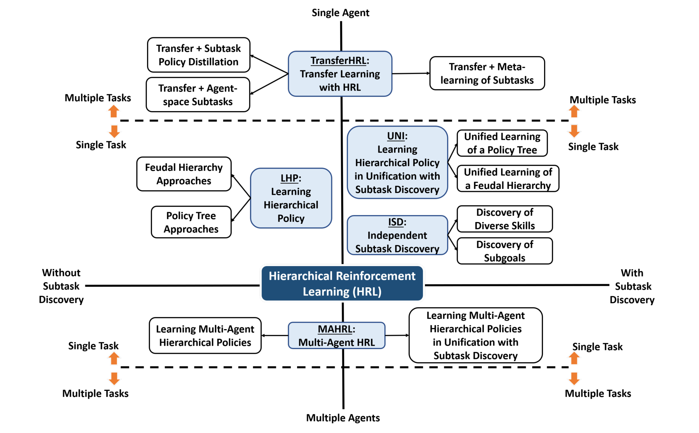
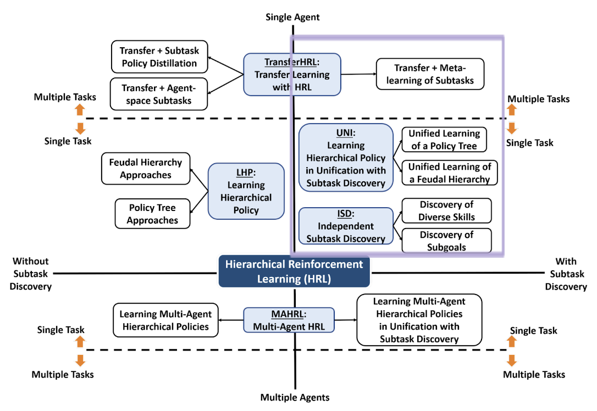

# OCRL_Hierarchical_Reinforcement_Learning_Paper_List

## APPROACHES FOR HIERARCHICAL REINFORCEMENT LEARNING

by [Hierarchical Reinforcement Learning: A Comprehensive Survey](https://github.com/SiyiDai/OCRL_Hierarchical_Reinforcement_Learning_Paper_List/blob/master/Hierarchical_Reinforcement_Learning:%20A_Comprehensive_Survey.pdf)

* Approaches with subtask discovery or without it. 
* Approaches for training single agent or multiple agents. 
* Approaches for learning on single task or multiple tasks.

1. Single agent, single task, without subtask discovery: The approaches in this division are
grouped into a major class called *Learning Hierarchical Policy* **(LHP)**. The LHP approaches
address the challenge of learning the hierarchical policy π hierarchy of an HRL agent with-
out concerning with subtask discovery. They use handcrafted subtasks.
2. Single agent, single task, with subtask discovery: The approaches in this division are
grouped into two major classes. The first class is called *Learning Hierarchical Policy in
Unification with Subtask Discovery* **(UNI)**. The UNI approaches address the challenge of
learning the subtask space Ω hier ar chy and the hierarchical policy π hier ar chy in a unified
or end-to-end manner. The second class is called *Independent Subtask Discovery* **(ISD)**.
The approaches in this class address the challenge of discovering task-agnostic subtasks
independently from any specific task. The subtask discovery is usually performed in a
pre-training stage and then the subtasks are used to learn HRL agents on downstream
tasks.
3. Multiple agent, single task, without subtask discovery.
4. Multiple agent, single task, with subtask discovery. The approaches in divisions 3 and 4
are grouped into one class called *Multi-Agent HRL* **(MAHRL)**. The MAHRL approaches
broadly address the challenge of learning to coordinate among multiple HRL agents on a
single joint task.
5. Single agent, multiple tasks, without subtask discovery.
6. Single agent, multiple tasks, with subtask discovery. The approaches in divisions 5 and 6
are grouped into one class called *Transfer learning with HRL* **(TransferHRL)**. The Trans-
ferHRL approaches broadly address the challenge of learning to transfer the hierarchical
policy, subtasks, or other knowledge of an HRL agent across multiple tasks, where the
subtasks may be handcrafted or discovered from scratch on multiple tasks.

-------------------

# Presentation Plan: Single Agent Hierarchical Reinforcement Learning with Subtask Discovery
#### Keywords explanation: MDPs, SMDPs, Options, Actor-Critic, Subtask discovery, (Feudal), Skill Chaining, multi-level control, meta-learning 

### UNI = Subtask Discovery + Learning Hierarchical Policy

#### Unified Learning of Policy Tree

0. **Options** (MDPs, SMDPs, option value function) [multi-level control]

    [AI 1999] [cited by 3296] [Between MDPs and semi-MDPs: A framework for temporal abstraction in reinforcement learning](https://people.cs.umass.edu/~barto/courses/cs687/Sutton-Precup-Singh-AIJ99.pdf) + [Video1](https://rl-vs.github.io/rlvs2021/hierarchical.html) + [video2](https://www.youtube.com/watch?v=e8b0yC6COJ8) + [intro](https://zhuanlan.zhihu.com/p/58895331)

1. **Option-Critic = Options + Actor-Critic** [multi-level control]

    [AAAI 2017] [cited by 766] [The Option-Critic Architecture](https://ojs.aaai.org/index.php/AAAI/article/view/10916) + [Video](https://www.youtube.com/watch?v=xVkh5-aIvpg) + [intro1](https://zhuanlan.zhihu.com/p/217811126) + [intro2](https://zhuanlan.zhihu.com/p/87910900) + [intro3](https://zhuanlan.zhihu.com/p/47051292) + [intro4](https://zhuanlan.zhihu.com/p/430471198)

2. **Skill Chaining** [Skill Chaining]

    [NIPS 2009] [cited by 279] [Skill discovery in continuous reinforcement learning domains using skill chaining](https://proceedings.neurips.cc/paper/2009/hash/e0cf1f47118daebc5b16269099ad7347-Abstract.html) + [intro1](https://zhuanlan.zhihu.com/p/267524544) + [intro2](https://zhuanlan.zhihu.com/p/360717953)

    [ICLR 2020] [cited by 36] [Option Discovery using Deep Skill Chaining](https://openreview.net/forum?id=B1gqipNYwH) + [intro1](https://zhuanlan.zhihu.com/p/470756983) + [code](https://github.com/deep-skill-chaining/deep-skill-chaining)

    
#### Unified Learning of Feudal Hierarchy

3. **FeUdal Networks** [goal-reach] 

    [ICML 2017] [cited by 657] [FeUdal networks for hierarchical reinforcement learning](http://proceedings.mlr.press/v70/vezhnevets17a/vezhnevets17a.pdf) + [Video(en)](https://www.youtube.com/watch?v=DLVjU75x0WQ) + [Video(zh)](https://www.youtube.com/watch?v=uVTbqat92Ps) + [intro1](https://zhuanlan.zhihu.com/p/46928498) + [intro2](https://zhuanlan.zhihu.com/p/191526908)

### Independent Subtask Discovery (ISD) 
4. **SecTAR**

    [PMLR 2018] [cited by 99] [Self-Consistent Trajectory Autoencoder: Hierarchical RL with Trajectory Embeddings](http://proceedings.mlr.press/v80/co-reyes18a/co-reyes18a.pdf) + [Video](https://www.youtube.com/watch?v=2mw1tcbz19g) + [code](https://github.com/wyndwarrior/Sectar)

### Transfer Learning with HRL (TransferHRL)
5. **TransferHRL with subtask discovery**

    [NIPS 2018] [cited by 282] [Meta Learning Shared Hierarchies](https://arxiv.org/pdf/1710.09767.pdf) + [video](https://www.youtube.com/watch?v=M_eaS7X-mIw) + [video](https://www.youtube.com/watch?v=WpSc3D__Av8) + [intro1](https://zhuanlan.zhihu.com/p/92989026) + [intro2](https://zhuanlan.zhihu.com/p/75433684) + [news](https://zhuanlan.zhihu.com/p/30501169)

----------------------
## Paper List Draft

[Dec 6 2021] [Hierarchical Reinforcement Learning with Timed Subgoals (HiTS)](https://github.com/SiyiDai/OCRL_Hierarchical_Reinforcement_Learning_Paper_List/blob/master/Hierarchical_Reinforcement_Learning_With_Timed_Subgoals.pdf)   + [Video](https://www.youtube.com/watch?v=JkPaI3uZU6c)

[Oct 2021] [Detect, Understand, Act: A Neuro-Symbolic Hierarchical Reinforcement Learning Framework](https://github.com/SiyiDai/OCRL_Hierarchical_Reinforcement_Learning_Paper_List/blob/master/A_Neuro-Symbolic_Hierarchical_Reinforcement_Learning_Framework.pdf) +  [Video](https://www.youtube.com/watch?v=1gsLt-zFXiY)

[Nov 2019] [Hierarchical Reinforcement Learning Method for Autonomous Vehicle Behavior Planning](https://github.com/SiyiDai/OCRL_Hierarchical_Reinforcement_Learning_Paper_List/blob/master/Hierarchical_Reinforcement_Learning_Method_for_Autonomous_Vehicle_Behavior_Planning.pdf) + [Video](https://www.youtube.com/watch?v=I4KGeYYyP4g)

[IEEE ITSC 2021] [Trajectory Planning for Autonomous Vehicles Using Hierarchical Reinforcement Learning](https://github.com/SiyiDai/OCRL_Hierarchical_Reinforcement_Learning_Paper_List/blob/master/Trajectory_Planning_for_Autonomous_Vehicles_Using_Hierarchical_Reinforcement_Learning.pdf) +   [Video](https://www.youtube.com/watch?v=R5nWhzCBLFs)

--
### Learning Hierarchical Policy (LHP)
[NeurIPS 2018] [cited by 466] [Data-Efficient Hierarchical Reinforcement Learning (Google)](https://github.com/SiyiDai/OCRL_Hierarchical_Reinforcement_Learning_Paper_List/blob/master/NeurIPS-2018-data-efficient-hierarchical-reinforcement-learning-Paper.pdf) + [Video](https://www.youtube.com/watch?v=VetQHnyiRrI)

--
### Unifying Subtask Discovery with the Learning of Hierarchical Policy (UNI)
#### Unified Learning of Policy Tree
[2016] [cited by 103] [Probabilistic inference for determining options in reinforcement learning](https://link.springer.com/article/10.1007/s10994-016-5580-x) 

[NIPS 2009] [cited by 279] [Skill discovery in continuous reinforcement learning domains using skill chaining](https://proceedings.neurips.cc/paper/2009/hash/e0cf1f47118daebc5b16269099ad7347-Abstract.html)

[AI 1999] **[cited by 3296]** [Between MDPs and semi-MDPs: A framework for temporal abstraction in reinforcement learning](https://people.cs.umass.edu/~barto/courses/cs687/Sutton-Precup-Singh-AIJ99.pdf) --> Options

[AAAI 2017] **[cited by 766]** [The Option-Critic Architecture](https://ojs.aaai.org/index.php/AAAI/article/view/10916) + [Video](https://www.youtube.com/watch?v=xVkh5-aIvpg) --> Options + Actor-Critic = Option-Critic

[2017] [cited by 35] [Learnings options end-to-end for continuous action tasks](https://arxiv.org/abs/1712.00004)

[NeurIPS 2018] [cited by 51] [Learning abstract options](https://proceedings.neurips.cc/paper/2018/hash/cdf28f8b7d14ab02d12a2329d71e4079-Abstract.html)

[NeurIPS 2019] [cited by 22] [DAC: The Double Actor-Critic Architecture for Learning Options](https://proceedings.neurips.cc/paper/2019/hash/4f284803bd0966cc24fa8683a34afc6e-Abstract.html)

#### Unified Learning of Feudal Hierarchy

[2017] **[cited by 657]** [FeUdal networks for hierarchical reinforcement learning](http://proceedings.mlr.press/v70/vezhnevets17a/vezhnevets17a.pdf) + [Video(en)](https://www.youtube.com/watch?v=DLVjU75x0WQ) + [Video(zh)](https://www.youtube.com/watch?v=uVTbqat92Ps) + [intro](https://zhuanlan.zhihu.com/p/46928498)

[ICLR 2019] [cited by 120] [Near-Optimal Representation Learning for Hierarchical Reinforcement Learning](https://arxiv.org/abs/1810.01257)

--
### Independent Subtask Discovery (ISD)
#### Discovery of Diverse Skills

[PMLR 2018] **[cited by 99]** [Self-Consistent Trajectory Autoencoder: Hierarchical RL with Trajectory Embeddings](http://proceedings.mlr.press/v80/co-reyes18a/co-reyes18a.pdf)+ [Video](https://www.youtube.com/watch?v=2mw1tcbz19g)

[ICLR 2018] [cited by 212] [Learning an Embedding Space for Transferable Robot Skills](https://openreview.net/pdf?id=rk07ZXZRb)

#### Discovery of Subgoals

[Jul 2019] [cited by 13] [Learning World Graphs to Accelerate Hierarchical Reinforcement Learning](https://github.com/SiyiDai/OCRL_Hierarchical_Reinforcement_Learning_Paper_List/blob/master/Learning_World_Graphs_to_Accelerate_Hierarchical_Reinforcement_Learning.pdf) + [Video](https://www.youtube.com/watch?v=Qk4lJdp7ZAs)

[2001] [cited by 586] [Automatic discovery of subgoals in reinforcement learning using diverse density](https://scholarworks.umass.edu/cgi/viewcontent.cgi?article=1017&context=cs_faculty_pubs)

--
### Multi-task domain 
[cs.LG 2020] [cited by 163] [Dynamics-Aware Unsupervised Discovery of Skills](https://arxiv.org/abs/1907.01657) + [Video](https://www.youtube.com/watch?v=HYEzHX6-fIA)

